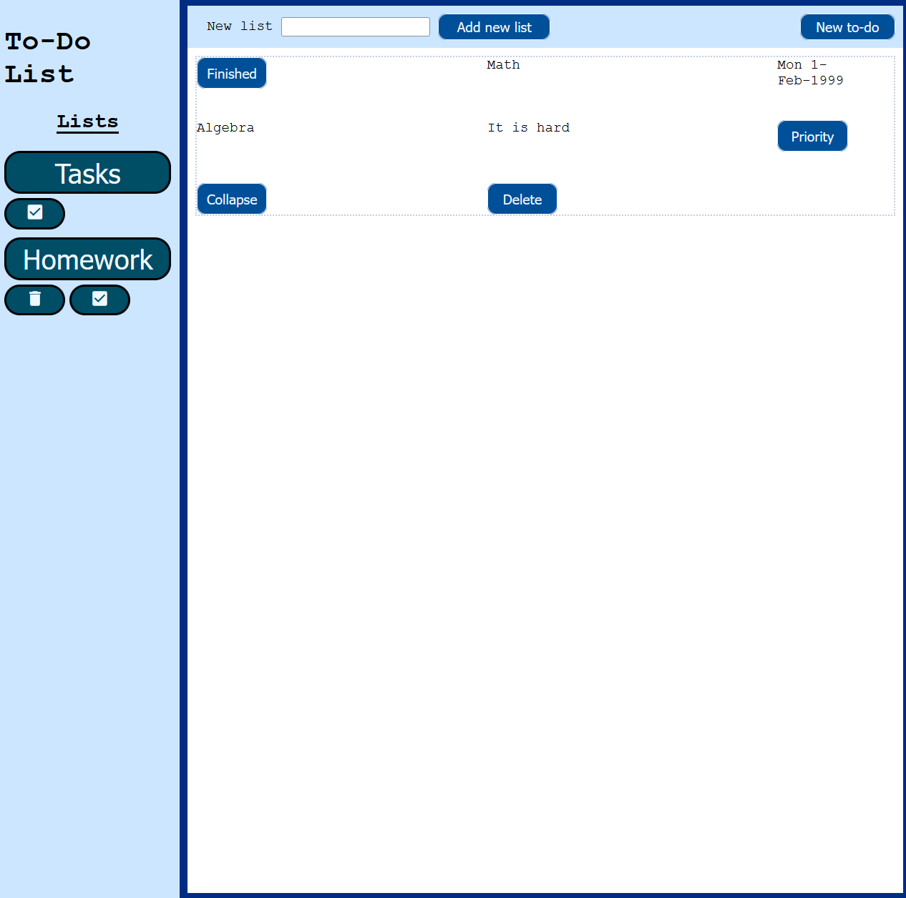

# A to-do list

This project is build using HTML, CSS and Javascript. Project uses ES6 modules and Webpack for bundling modules. Items like to-do's and lists are saved to your browser's localStorage. This means they will persist on a refresh but won't be accessible from another browser/device.

## The Odin Project: Lesson ToDo List

This project is build according to the specification of the [ToDo lesson](https://www.theodinproject.com/lessons/node-path-javascript-todo-list)

## Live website

Users can create separate lists and add to-do's to these lists. They can also show finished to-do's, prioritize them and delete them permanently.

Access via: <a href="https://gohan61.github.io/todo-list/">To-do list</a>
